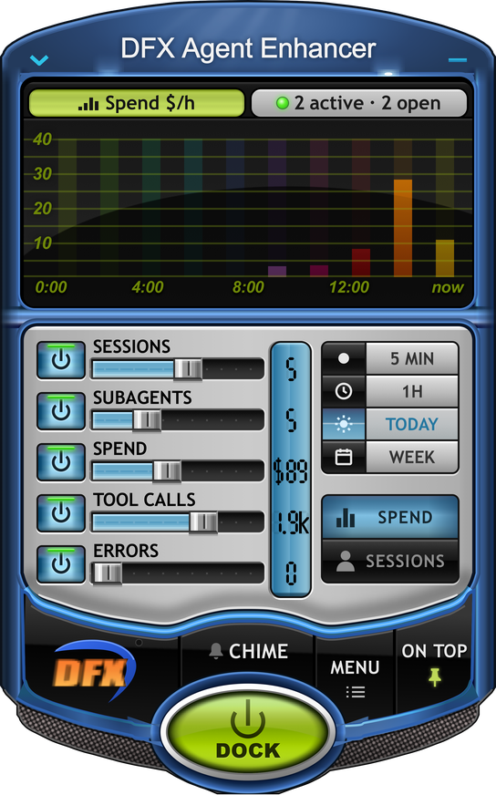

# DFX Agent Enhancer

A macOS menu-bar widget. It shows what your Claude Code and Cursor agents are doing, dressed up as the classic blue DFX Audio Enhancer.



Homepage: https://orenyomtov.github.io/dfx-agent-enhancer/

## Install

```
curl -fsSL https://raw.githubusercontent.com/orenyomtov/dfx-agent-enhancer/main/install.sh | bash
```

This puts the app in /Applications and turns on launch at login.

Or download the DMG and drag the app into Applications: https://github.com/orenyomtov/dfx-agent-enhancer/releases/latest/download/DFX-Agent-Enhancer.dmg

The app is not notarized, so macOS blocks it the first time you open it from the DMG. Open it once, then go to System Settings > Privacy & Security and click Open Anyway. Or run `xattr -dr com.apple.quarantine "/Applications/DFX Agent Enhancer.app"`. The install script doesn't need this.

## What it shows

- The graph shows what your Claude Code sessions and subagents spend, in dollars per hour, or the number of active sessions (the SPEND / SESSIONS keys). Spend is approximate: the usage the transcripts record (input, output, cache writes and reads), priced at Anthropic's API list prices. Cursor records no usage, so it has no spend.
- The rows show sessions, subagents, spend, tool calls and errors, each with a status LED.
- 5 MIN, 1H, TODAY and WEEK pick the time window. TODAY is the default and runs from midnight to now. Hover anything for exact numbers.
- The menu-bar icon is a tiny live copy of the graph, with the number of agents working right now.
- CHIME plays a sound when an agent finishes. DOCK shrinks the rack to a small deck.

## Launch at login

Turn it on or off with Launch at Login in the menu-bar menu.

## Uninstall

```
curl -fsSL https://raw.githubusercontent.com/orenyomtov/dfx-agent-enhancer/main/install.sh | bash -s -- --uninstall
```

Or by hand: turn off Launch at Login in the menu, quit, and drag the app from Applications to the Trash.

## Privacy

It only reads local files: Claude Code's transcripts and session files under `~/.claude`, Cursor's agent transcripts under `~/.cursor`, and the process list. It makes no network calls and never touches your agents.

## Build from source

Needs macOS and Python 3.11+.

```
git clone https://github.com/orenyomtov/dfx-agent-enhancer.git
cd dfx-agent-enhancer
python3 -m venv .venv && .venv/bin/pip install -e .
.venv/bin/python -m dfx_agent_enhancer
```

Tests: `.venv/bin/pip install -e '.[test]' && .venv/bin/python -m pytest -q`. Design notes and the full behaviour reference are in [NOTES.md](NOTES.md).

## Not affiliated

This is a fan homage to the DFX Audio Enhancer skin. It is not affiliated with or endorsed by the makers of DFX.
